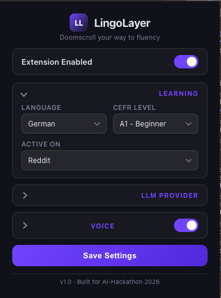
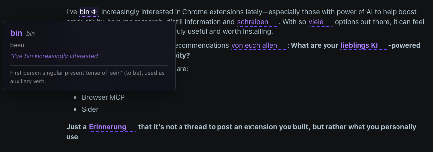

# LingoLayer: Contextual Immersion

> **"Stop ignoring your Duolingo owl. Start doomscrolling your way to fluency."**

Built in 3 hours for the [AI-Hackathon.space](https://ai-hackathon.space/) 2026.

---

## Screenshots

### Extension Popup



### In-Page Injection with Grammar Tooltip



---

## The Vision

Traditional language extensions are broken -- especially for German. Static word replacement ignores the complex grammar of German cases (Nominative vs. Dative). **LingoLayer** is a "Logic-at-the-Edge" extension that performs **Context-Aware Semantic Injection** entirely within your browser.

No backend. No data harvesting. Just raw AI-powered learning delivered where you already read.

## Features

- **Client-Side Intelligence:** Everything runs locally in the extension. Your API keys and reading habits never leave your machine.
- **5 Providers:** Bring your own key for **Featherless.ai**, **OpenAI**, **Claude (Anthropic)**, **Gemini (Google)**, or point to a **local/self-hosted server** (Ollama, LM Studio, vLLM, llama.cpp).
- **Model Selector Dropdown:** Each provider comes with a curated list of models sorted fastest-first. No need to look up model IDs.
- **10 Target Languages:** German, Spanish, French, Italian, Portuguese, Dutch, Japanese, Korean, Mandarin Chinese, and Hindi -- with grammar-aware prompts tailored to each language.
- **Grammar-Perfect Injection:** The engine analyzes the full sentence context to ensure replacements are grammatically correct (e.g., German articles matching case, Spanish ser/estar, Japanese particles).
- **Few-Shot Prompted:** Concrete translation examples per language ensure consistent, accurate output.
- **Voice Pronunciation:** Click the speaker icon on any replaced phrase to hear it spoken aloud. Uses **ElevenLabs** if an API key is provided, otherwise falls back to the **browser's built-in speech synthesis** (free, no key needed). Audio is cached so repeated plays cost nothing.
- **Flexible Activation Targets:** Use the **"Active On"** dropdown to choose where the extension should trigger.
  - *Current MVP Support:* **Reddit** (targeted at post body content).
- **CEFR Level Selector:** Choose between **A1 (Beginner)** to **B2 (Upper Intermediate)**. The AI selectively identifies phrases that challenge you without overwhelming you.
- **Collapsible Settings UI:** The popup groups settings into collapsible sections (Learning, Provider, Voice) so you can focus on what matters.
- **Per-Provider Credential Memory:** Switching between providers preserves your API keys, models, and endpoints -- nothing is lost.

## Supported Models

| Provider | Models |
|---|---|
| **Featherless.ai** | Qwen 3 8B, Qwen 3 32B, Qwen 2.5 7B/32B, Llama 3.1 8B, Mistral 7B |
| **OpenAI** | GPT-4.1 Nano, GPT-4.1 Mini, GPT-4.1, GPT-4o Mini, GPT-4o, o4-mini, o3-mini |
| **Claude** | Haiku 4.5, Sonnet 4.6, Sonnet 4, Opus 4.6 |
| **Gemini** | 2.5 Flash Lite, 2.5 Flash, 2.5 Pro, 2.0 Flash |
| **Local / Custom** | Any model your server exposes (Ollama, LM Studio, vLLM, llama.cpp) |

## Setup & Configuration

1. **Install:** Load the extension as unpacked in Chrome (see below).
2. **Learning:** Pick your target language and CEFR level -- this section is open by default.
3. **Provider:** Expand the provider section, choose a provider, select a model from the dropdown, and enter your API key:
   - **Featherless.ai** -- Default: `Qwen 3 8B`. Key prefix: `fl-...`
   - **OpenAI** -- Default: `GPT-4.1 Nano`. Key prefix: `sk-...`
   - **Claude (Anthropic)** -- Default: `Haiku 4.5`. Key prefix: `sk-ant-...`
   - **Gemini (Google)** -- Default: `Gemini 2.5 Flash Lite`. Key prefix: `AIza...`
   - **Local / Custom** -- Enter your endpoint URL. API key is optional.
4. **Voice (optional):** Expand the Voice section and toggle it on. Enter an ElevenLabs API key for premium voices, or leave it blank to use free browser speech synthesis.
5. **Save** and refresh your page to start learning.

## Installation

1. Clone this repo:
   ```bash
   git clone https://github.com/shyju-t/lingo-layer.git
   ```
2. Open Chrome and navigate to `chrome://extensions/`.
3. Enable **Developer Mode** (top right toggle).
4. Click **Load unpacked** and select the `lingo-layer` project folder.
5. Set up your provider and API key in the extension popup to begin.

## Using a Local Server

LingoLayer works with any locally hosted model that exposes an OpenAI-compatible `/v1/chat/completions` endpoint.

| Server | Endpoint URL |
|---|---|
| Ollama | `http://localhost:11434/v1/chat/completions` |
| LM Studio | `http://localhost:1234/v1/chat/completions` |
| vLLM | `http://localhost:8000/v1/chat/completions` |
| llama.cpp | `http://localhost:8080/v1/chat/completions` |

Select **Local / Custom** as the provider, paste the endpoint URL, enter the model name your server expects, and save. No API key is required for most local setups.

## Tech Stack

- **Manifest V3** Chrome Extension
- **Vanilla JavaScript** (ES6+) -- zero dependencies
- **CSS3 Glassmorphism** for a modern, transparent UI
- **Multi-Provider Support** -- Featherless.ai, OpenAI, Claude, Gemini, and Local/Custom
- **Dual TTS Engine** -- ElevenLabs (premium) with browser Web Speech API fallback (free)
- **Few-Shot Prompt Engineering** -- language-specific examples for accurate grammar

## How It Works

1. Content script detects the main post body on supported sites using a Selector Registry.
2. Post text (capped at 2000 chars for speed) is sent with a strict JSON-mode system prompt containing few-shot examples and grammar rules for the selected language.
3. The response contains replacements with the original English phrase, translation, grammar metadata, and pronunciation guide.
4. The injection engine performs text-search-based DOM replacement (no fragile character offsets).
5. Replaced phrases are styled inline with hover tooltips showing the original text, grammar case/gender, and pronunciation.
6. Click the speaker icon to hear the phrase -- uses ElevenLabs if a key is set, otherwise the browser's native speech synthesis with smart voice selection (prefers high-quality Google voices).

## Architecture

```
popup (collapsible settings, model dropdowns)
  |
  +--> chrome.storage.local (per-provider credential memory)
         |
         +--> content script
                |
                +--> Selector Registry (find post body)
                +--> API Client (Featherless / OpenAI / Claude / Gemini / Local)
                +--> Injector (text-search DOM replacement)
                +--> de-bridge spans (hover tooltips + speaker icon)
                +--> TTS Client (ElevenLabs or browser speechSynthesis)
```

## Project Structure

```
lingo-layer/
├── manifest.json              # Manifest V3 config
├── popup/
│   ├── popup.html             # Collapsible settings, model dropdown
│   ├── popup.js               # Per-provider settings + dynamic model list
│   └── popup.css              # Glassmorphism dark UI
├── content/
│   ├── content.js             # Page orchestrator (single API call per page)
│   ├── injector.js            # Text-search DOM replacement + speaker buttons
│   └── content.css            # Tooltip, shimmer, toast, speaker styles
├── background/
│   └── service-worker.js      # Install defaults, badge count
├── lib/
│   ├── selectors.js           # Reddit selector registry + shadow DOM piercing
│   ├── prompt.js              # Few-shot system prompts per language
│   ├── llm-client.js          # Multi-provider API client (5 providers)
│   └── tts.js                 # ElevenLabs + browser TTS with voice ranking
├── icons/
│   ├── icon16.png
│   ├── icon48.png
│   └── icon128.png
├── screenshots/
│   ├── popup.png
│   └── injection.png
├── .gitignore
└── README.md
```

---

*Built with coffee and 2026-era AI.*
